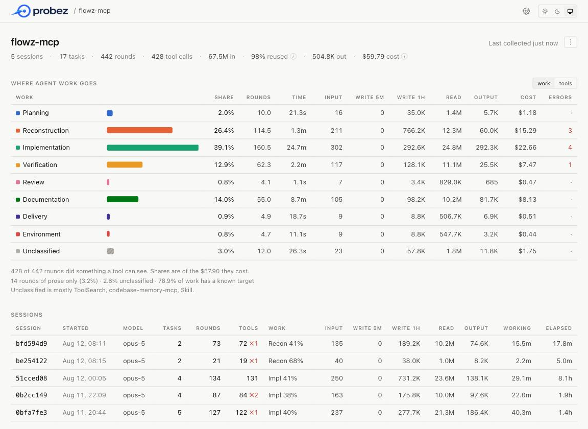
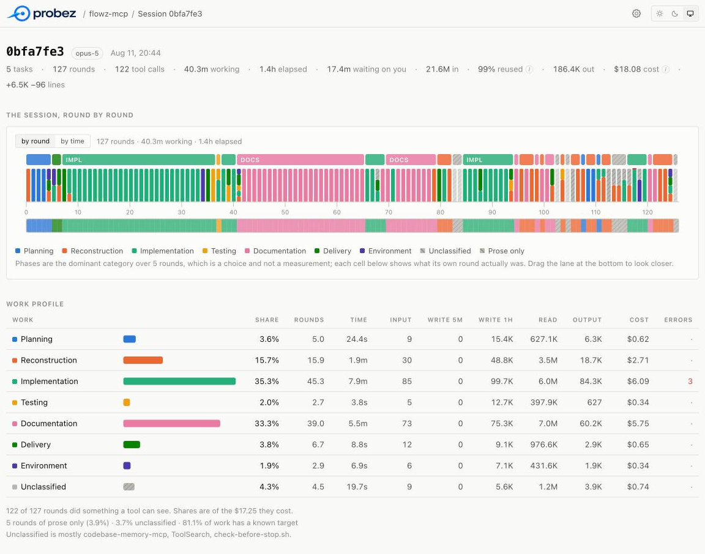

<p align="center">
  <picture>
    <source media="(prefers-color-scheme: dark)" srcset="docs/logo-dark.png">
    
  </picture>
</p>

<p align="center">
  <a href="https://www.npmjs.com/package/probez-cli"></a>
  <a href="https://github.com/flowzhq/probez/actions/workflows/ci.yml"></a>
  <a href="https://nodejs.org"></a>
  <a href="LICENSE"></a>
</p>

<p align="center">
  <strong>See what your coding agents actually did. Every session, measured locally.</strong>
</p>

Coding agents already log every session: each LLM call, every tool invocation, the timing between.
probez normalizes that into one record per LLM round and shows you where the work — and the money —
actually went. Nothing leaves your machine.

## Quick start

**1. Install.** Needs **Node 20+** and nothing else — zero runtime dependencies.

```bash
npm install -g probez-cli
```

Or skip the install and put `npx probez-cli` wherever `probez` appears below.

**2. Collect a project you work in.** Nothing to set up first: the history is already on disk, so
the first run reads months of sessions you have already had.

```bash
cd ~/any/project-you-work-in
probez collect
```

It reads [Claude Code](https://claude.com/claude-code) sessions from `~/.claude/projects` and [Cursor](https://cursor.com) transcripts from `~/.cursor/projects`, then writes
one record per LLM round under `~/.probez`. Run it again whenever you want to catch up — it reads
only what changed. `probez collect --all` does every project on the machine at once. A repository
used in both agents is one project. Cursor transcripts do not include token usage, so those rounds
have no cost.

**3. Look at what came back**, in the browser or in the terminal:

```bash
probez view   # the profiler: projects, sessions, tasks, rounds
probez        # the project as one summary — it collects first, so it stands in for step 2
```

Both are below: [the view](#the-view) first, [the CLI](#the-cli) after.

## The view

`probez view` opens a local profiler in your browser: every project, then a session, then a task,
down to a single tool call. It listens on `127.0.0.1` with a token that is new on every run.

**A project** — where its work went, what each kind of work cost, and the sessions it happened in.
The list under it is three tabs: *sessions*, each row carrying the whole spread of its work as a bar
rather than the name of its largest slice; *trails*, every trail the project made through itself; and
*questions*, everything it needed to know and what each answer cost. Either kind of row opens the
task it happened in, with the trail or the question already open on the round it started at.

<p align="center">
  
</p>

**A session** — the trace. Two rows over one axis: the phases the agent moved through, and the
rounds themselves, each stacked by the work it did. Click a round to open it in full — what it was
asked, what it said, and every tool call marked with the work it was counted as; the arrow keys walk
to the next. Opening a call shows the arguments it was given, and **Show result** reads what came
back out of the archived session — fetched when you ask for it, not when the page loads. A round
also says how full the model's context window its input was — green to 20%, amber to 80%, red above
it — and a round that followed an auto-compaction is drawn under a rule saying what was dropped and
how long it took.

<p align="center">
  
</p>

A task's trace has a third row between the two, when the task made any: brackets over the rounds
they touched, drawing either the **trails** or the **questions** — a toggle beside the axis, when
there is both to see. Neither is a stretch of rounds. A trail is what the evidence connects, so a
search interrupted by an edit and resumed four rounds later is still one search; a question is what
chased one word, so a grep run for the sixth time is still that question. The phase ribbon can show
neither. Hover a bracket for what it did and what it cost, click it to light up the rounds it
touched, and read it call by call underneath.

One lane and not two, because the two readings cover much the same rounds and stacking them would
put two near-identical bars over one strip. Hatching means the same thing in both — part of this
went nowhere: a trail that changed nothing, a question part of which was asking again. A question
answered in one call is a point rather than a span, so it gets no bracket; the note under the trace
says how many are not drawn.

Under the trace, **what it needed to know**: the same calls read the other way. A trail is what
followed something; a question is what was being asked, including the asking that got nowhere — and
since a trail's hops exist only where a call narrowed, a call that asks the same thing over again
appears in no trail at all. Clicking a question lights the rounds it touched and lists every call it
took, with `↺` against the ones that asked what had already been asked. Questions answered in a
single call are counted under the table rather than listed in it. **Explain** on any one of them
hands its calls to your own LLM and puts back the sentence it was after, beside the measured kind
rather than over it; from then on the table shows the sentence in place of the search terms. See
`probez questions` and `probez explain` below.

Three things worth knowing:

- **The axis is round index, with time as a toggle.** On a time axis the slowest round dwarfs the
  rest, so most collapse into slivers you cannot click. `working` is the time the model spent
  generating; `elapsed` adds the tools it waited on and the turns it waited on you.
- **Phases are smoothed over five rounds**, and the page says so. The raw per-round category gives
  a band every round or two, which is a barcode rather than a story. Every cell still shows what
  its own round actually was.
- **Rounds no tool saw are drawn hatched**, not dropped. They carry no label and sit outside every
  share, but a timeline missing 5% of its rounds would lie about how long the task took.

**Settings** holds the token rates every cost is computed from — one row per model, five rates
each, at published list prices and yours to change. Stored in `~/.probez/pricing.json`, owner-only.
Under them sits the **reader**: the command *explain* runs, which is the only program probez ever
starts. It is argv and not a shell line, it runs only when you press explain on one question, and
leaving it blank leaves probez with nothing it could run.

Each project carries a **⋮** menu, on its own page and on every row of the projects list. *Sync*
runs `collect` then `analyze` for that project. *Rename* gives it a name of your own — a label, on
this machine, that the CLI answers to as well; nothing moves, since a project's directory in the
store is a hash of the path an agent ran in, and clearing the field puts the derived name back.
*Export* hands its rounds or a full bundle to your browser to save. *Delete* removes the project and
everything probez recorded for it, after asking; the agent's own session files are not touched, so a
collected project comes back with `probez collect` minus whatever the agent has since pruned, and an
imported one does not come back at all. **Import** on the projects page reads a file someone sent
you — which is also why the view opens on an empty store, and why a project that arrived that way is
marked `imported` in the list.

## The CLI

Everything the view shows, one table at a time. The levels nest, and every level has a name you can
type back:

```
project                a directory an agent was started in    its name, or its path
└─ session             one agent run                          504799b8
   ├─ subagent         one run the agent handed off           504799b8/a8261ff4
   └─ task             a user turn, and everything it led to  504799b8#3
      └─ round         one LLM call                           504799b8#3.12
         └─ tool call                                         shown in full by its round
```

| Command | What it does |
| --- | --- |
| `probez [project]` | Collect, then summarize |
| `probez projects` | Every project on this machine |
| `probez sessions` · `session <id>` | One row per session, or one session as its tasks |
| `probez tasks` · `task <id>` | One row per task, or one task and every round it took |
| `probez rounds` · `round <id>` | One row per round, or one round with every tool call |
| `probez tools` | Every tool called, and what `Bash` actually ran |
| `probez trails` · `trail <id>` | Runs of calls that followed one another into the repository |
| `probez questions` · `question <id>` | What the agent needed to know, and what finding out cost |
| `probez explain <id>` | Ask your own LLM what one question was, in a sentence |
| `probez analyze` | Where the work went |
| `probez view` | Open the profiler |
| `probez collect` | Collect one project, or every project under a folder |
| `probez export <project>` | Write a project out as a file to send someone |
| `probez import <file>` | Read a project someone sent you |

Lists take `--limit` and always say how many rows they withheld. `rounds` filters by `--session`,
`--task`, `--tool`, `--command`, `--kind`, `--category`, `--target`, `--agent` and `--errors`, and
`sessions` takes `--agent` too.
`analyze` takes `--by`, `--split` and `--unclassified`. `trails` takes `--deep`, `--min-depth` and
`--outcome`. `questions` takes `--kind` and `--min-calls`, and `explain` takes `--again` and `--prompt`.
`--source` selects Claude Code, Cursor, or
both. `--json` works everywhere. `probez --help` lists every flag under the command it belongs to.

```console
$ probez

probez  flowz-mcp  ~/Dev/workspace/flowz-mcp

  sessions   8         rounds   652      tasks  24
  tokens     94.4M in · 646.3K out
             1.2K new · 2.0M cached · 92.4M reused  (98% reused)
  span       Aug 11 – Aug 18, 2026
  top tools  Bash 292 · Edit 125 · Write 91 · Read 84 · mcp__codebase-memory-mcp__query_graph 12

  +652 rounds, 9 sessions read
  → ~/.probez/projects/flowz-mcp-75ad21ac/rounds.jsonl
```

Sessions of a project, newest last:

```console
$ probez sessions flowz-mcp

  flowz-mcp  ~/Dev/workspace/flowz-mcp

  SESSION    ROUNDS  TASKS  TOOLS           IN      OUT       COST  WORK       LAST
  0bfa7fe3      127      5  122 ✗1       21.6M   186.4K     $18.08  Impl 37%   14 days ago
  0b2cc149       87      4  84 ✗2        10.1M    97.6K      $9.18  Impl 38%   14 days ago
  51cced08      134      4  131          24.3M   138.1K     $22.57  Impl 39%   14 days ago
  be254122       21      2  19 ✗1         1.0M     8.2K      $1.08  Recon 55%  14 days ago
  bfd594d9       73      2  72 ✗1        10.4M    74.6K      $8.87  Recon 34%  14 days ago
  6ffef9bc       33      4  30            2.2M    17.5K      $2.19  Recon 52%  9 days ago
  c21c7448      146      2  145 ✗5       22.8M   112.6K     $18.83  Recon 43%  9 days ago
  069d8593       31      1  30 ✗3         1.9M    11.3K      $1.76  Recon 72%  8 days ago

  8 sessions · 652 rounds · $82.58
  `probez session <id>` shows one of them, task by task.
```

When the agent hands work to a subagent, that run is a session of its own, named for the one that
handed it over. It is a separate context with its own model and its own bill, so it is counted
separately rather than folded into the session that delegated it:

```console
$ probez sessions flowz-agentic-sdlc --limit 6

  flowz-agentic-sdlc  ~/Dev/workspace/flowz-agentic-sdlc

  SESSION            AGENT ROUNDS  TASKS  TOOLS           IN      OUT       COST  WORK       LAST
  6b45d8d7/a5420a73  sub        7      1  17          182.4K     5.8K      $0.84  Recon 83%  25 days ago
  6b45d8d7/ab80aaad  sub        8      1  16          197.9K     5.4K      $0.86  Recon 86%  25 days ago
  6b45d8d7           main     122      8  234 ✗3       58.6M   139.5K     $76.13  Docs 29%   25 days ago
  15ac167d/a29da1c6  sub        7      1  19          135.0K     9.1K      $0.94  Recon 93%  25 days ago
  15ac167d/ad108a22  sub       18      1  38          515.5K    17.7K      $1.99  Plan 65%   25 days ago
  15ac167d           main     150     16  298 ✗3       27.6M   180.4K     $42.13  Docs 28%   25 days ago

  showing 6 of 23 sessions · 3744 rounds · $941.53, --limit 0 for all
  `probez session <id>` shows one of them, task by task.
```

`probez session <id>` says underneath a session's own tasks what it handed off, and what that cost:

```console
$ probez session flowz-agentic-sdlc 15ac167d --limit 3

  flowz-agentic-sdlc  ~/Dev/workspace/flowz-agentic-sdlc

  session 15ac167d  ·  16 tasks · 150 rounds · 27.6M in · 180.4K out · 3 tool errors · Jul 31, 2026

  TASK         ROUNDS       IN     OUT     TIME  WORK       FROM     ASKED
  15ac167d#1       12   517.7K   10.8K     2.6m  Docs 55%   a938f1f  start tracking the proje…
  15ac167d#2        5   275.1K    5.9K     1.4m  Docs 75%   6e9716d  once i a while i'll post…
  15ac167d#3        1    58.4K    1.5K    23.8s  —          9e4e660  we are implementing task…

  showing 3 of 16 tasks · 150 rounds, --limit 0 for all. `probez task 15ac167d#1` shows one in full

  handed to 2 subagents · 25 rounds · 650.5K in · 26.7K out, none of it counted above

  TASK                 ROUNDS       IN     OUT     TIME  WORK       FROM     ASKED
  15ac167d/a29da1c6#1       7   135.0K    9.1K     2.1m  Recon 93%  9e4e660  Decompose PRD-001 (…
  15ac167d/ad108a22#1      18   515.5K   17.7K     4.0m  Plan 65%   a1b59fd  Audit this repo's S…
```

A session as its tasks, each with the commit the tree was on when it was asked:

```console
$ probez tasks flowz-agentic-sdlc --session 15ac167d --limit 8

  flowz-agentic-sdlc  ~/Dev/workspace/flowz-agentic-sdlc

  TASK         ROUNDS       IN     OUT     TIME  WORK       FROM     ASKED
  15ac167d#1       12   517.7K   10.8K     2.6m  Docs 55%   a938f1f  start tracking the proje…
  15ac167d#2        5   275.1K    5.9K     1.4m  Docs 75%   6e9716d  once i a while i'll post…
  15ac167d#3        1    58.4K    1.5K    23.8s  —          9e4e660  we are implementing task…
  15ac167d#4        3   186.2K    3.4K    51.7s  Plan 100%  9e4e660  what next? M2?
  15ac167d#5        3   215.4K    6.9K     1.3m  Docs 50%   9e4e660  do we have this in the d…
  15ac167d#6        4   307.5K    3.0K    41.9s  Docs 67%   2a0c9e7  this should be in the co…
  15ac167d#7       20     2.1M   36.2K     7.3m  Docs 46%   be347e3  i see the task, yet no m…
  15ac167d#8        4   569.1K    6.4K     1.5m  Recon 42%  52900e4  add to the metrics ledge…

  showing 8 of 16 tasks, --limit 0 for all. `probez task <id>` shows one in full
```

**`FROM` is where the task began, not what it produced.** Tasks 3, 4 and 5 all start from
`9e4e660`, so those three asks were made against the same tree; the hash then moves, which is the
work of the task before it landing. It is read from git's HEAD reflog when the project is
collected — no `git` runs — and it is blank for a project that is not a checkout.

And what the work actually was:

```console
$ probez analyze flowz-mcp

  flowz-mcp  ~/Dev/workspace/flowz-mcp

  WORK                  ROUNDS    SHARE      COST  ERRORS      TIME      OUT
  Planning                49.2    10.4%     $8.38     1.0     58.4s    19.2K
    read                  37.2     8.7%     $6.96     1.0     16.9s    10.0K
    design                 8.0     1.1%     $0.86       ·       0ms      248
    clarify                4.0     0.7%     $0.55       ·     41.5s     9.0K
  Reconstruction           203    24.4%    $19.55    13.0      4.3m   107.2K
    read                  96.5    10.6%     $8.46     2.0     46.4s    41.7K
    locate                81.0     9.7%     $7.80     7.0      1.4m    38.8K
    mcp                   16.0     1.9%     $1.53     4.0     21.0s    13.2K
    inspect                9.1     2.2%     $1.75       ·      1.8m    13.5K
  Implementation           188    33.8%    $27.10     8.0     30.6m   341.8K
    modify                 132    20.9%    $16.77     8.0      8.2m   128.1K
    create                56.0    12.9%    $10.33       ·     22.4m   213.7K
  Testing                 34.3     5.2%     $4.14       ·     13.7s     7.2K
    test                  34.3     5.2%     $4.14       ·     13.7s     7.2K
  Documentation           73.0    13.2%    $10.56       ·     10.5m   105.5K
    system                59.0    10.4%     $8.36       ·      6.3m    75.2K
    agent                 14.0     2.7%     $2.20       ·      4.2m    30.3K
  Delivery                41.9     5.3%     $4.23     1.0     36.8s    16.0K
    build                 36.9     4.6%     $3.71     1.0     18.1s     9.1K
    branch                 4.5     0.6%     $0.47       ·     16.0s     6.5K
    commit                 0.5     0.0%     $0.04       ·      2.7s      385
  Environment             12.4     3.4%     $2.73     3.0     18.8s     6.7K
    env                   10.4     3.2%     $2.56     3.0     15.1s     5.3K
    deps                   2.0     0.2%     $0.16       ·      3.7s     1.4K
  Unclassified            31.5     4.4%     $3.53     1.0     45.4s    18.5K
    unknown               30.5     4.3%     $3.44     1.0     44.2s    18.1K
    incidental             1.0     0.1%     $0.09       ·      1.1s      378

  633 rounds did something a tool can see, out of 652. Shares are of the $80.21 they cost
  19 rounds of prose only (2.9%) · 5.0% unclassified · 69.4% of work has a known target
  Unclassified is mostly codebase-memory-mcp, ToolSearch, Skill. --unclassified lists it
  28.6% of the finding was inside 10 trails, 4 of which ended in a change
  The deepest went 3 hops from a listing: `probez trail 069d8593#1.1`
```

**A share is a share of money.** `ROUNDS` says how much of the work a category was; `SHARE` says how
much of the bill. Cost is worked out per round from its own model's rates, then split across that
round's work. The last lines are part of the answer: rounds of pure prose and tools with no entry in
the table sit outside the shares, and are reported rather than guessed at.

### Trails: how the agent found its way around

An agent that does not know a repository finds its way around it. It lists the tree, opens what the
listing named, greps for a word, reads the lines the grep hit. Every one of those calls is
Reconstruction, and a tally of Reconstruction cannot tell five hops of one search from five unrelated
file opens. A **trail** is that search:

```console
$ probez trails flowz-mcp --deep --limit 8

  flowz-mcp  ~/Dev/workspace/flowz-mcp

  TRAIL          STEPS  DEPTH  WIDE  PATHS  ROOT     OUTCOME        IN    TIME
  069d8593#1.0       6      5     2      7  listing  abandoned  268.5K    6.0s
  0b2cc149#1.0       5      4     2      3  listing  abandoned  188.4K    3.0s
  0b2cc149#3.8       3      2     2      3  listing  test       131.8K    1.6s
  0b2cc149#3.13      4      4     1      4  path     test       214.1K    2.8s
  0bfa7fe3#1.0       3      2     2      2  listing  test       105.7K    1.0s
  51cced08#2.1      16      6    11     23  listing  edit       999.1K    8.6s
  51cced08#2.70      3      3     1      4  doc      test       567.2K   500ms
  6ffef9bc#1.0       5      4     2      9  listing  abandoned  204.2K    6.7s

  showing 8 of 14 trails, --limit 0 for all · 13 proven from result bodies
  `probez trail <id>` draws one of them, hop by hop.
```

`DEPTH` is how far the search went and `WIDE` how far it fanned from a single call — a listing whose
output feeds five reads is wide and shallow, a chain of follows is deep and narrow. `ROOT` is what it
started from and `OUTCOME` whether it ended in a change to somewhere it had been. A trail is named by
the round it starts at, and asking for any round it passed through finds it:

```console
$ probez trail flowz-mcp 069d8593#1.0 --deep

  trail 069d8593#1.0 → 1.10 · 6 steps · proven
  depth 5 · breadth 2 · 7 paths · 1 revisited
  from a listing · abandoned · 268.5K in · 1.5K out · 6.0s

  ROUND   REACHED FOLLOWED                CALL
  1.0     dir     started here            ls -la && echo "--- git ---" && git log --oneli…
  1.1     dir     listed docs               find docs -type f | sort && echo "--- interna…
  1.2     dir     listed docs/tasks/RE…       cat docs/tasks/README.md && echo "===== ada…
  1.4     file    listed cmd/livemodel…         cat internal/graph/codebasememory/engine.…
  1.5     dir     listed .flowz                   which codebase-memory-mcp; echo "---env…
  1.10    tree    listed docs/tasks/T-…       find ~/.cache/codebase-memory-mcp -maxdepth…

  `probez round 1.0` shows any one of these calls in full.
```

`CALL` is what actually ran, indented by how deep into the walk it sits, and `FOLLOWED` is the
evidence for each hop. There are three kinds of evidence. `listed` means the path was in
the earlier call's own output, which is proof — and reading it needs the archived session, which is
what `--deep` is for. Without the flag a hop is inferred from what the calls asked for: `probe`, a
search for a word and then a file carrying it, and `narrow`, a file under a directory already
reached. Each trail says which kind it had, on the `proven`/`inferred` line.

The two readings are not two views of one answer. Against probez's own store the deep read finds
about half again as many steps, and it roots a trail further back — the same search the shallow read
names `1.5` is named `1.0` once the listing that started it becomes visible. It is not strictly a
superset either: a better-sourced hop can regroup a trail, and a fragment left under the three-call
floor stops being one.

### Questions: what it needed to know, and what that cost

A trail is a walk that went somewhere. Its edges exist only where a call *narrowed* — a smaller
scope, a file under a directory already reached — so a call that asks the same thing over again
narrows nothing, forms no edge, and joins no trail. In probez's own store a third of all finding is
exactly that, and a tenth of it reaches a trail. The trail keeps the productive hops and drops the
thrash, which is the wrong way round for anyone asking what navigation costs.

A **question** is the other reading of the same calls: one thing the agent needed to know, and every
call it spent finding out, whether or not any of them got anywhere.

```console
$ probez questions flowz-mcp --min-calls 2 --limit 8

  flowz-mcp  ~/Dev/workspace/flowz-mcp

  QUESTION        CALLS  AGAIN  FETCH  GUESS  KIND          IN    TIME  ASKED ABOUT
  51cced08#2.3       11      0     10      0  outline   664.3K    6.5s  claude
  c21c7448#2.13       9      0      8      0  outline   775.9K    3.6s  contextfacets
  c21c7448#2.4        8      0      7      0  outline   484.3K    1.7s  claude
  6ffef9bc#4.17       5      1      2      1  flow      395.1K    3.1s  facets type const confidence …
  069d8593#1.1        4      0      3      0  touches   179.6K    3.8s  —
  be254122#2.15       4      0      3      0  touches   230.2K   682ms  —
  069d8593#1.15       3      1      0      0  refs      188.1K    6.3s  codebase memory
  0b2cc149#1.2        3      1      0      0  refs      116.1K    2.2s  enqueuer status

  showing 8 of 31 questions, --limit 0 for all
  152 asked in all · 220 calls · 1.45 per question · 31 took more than one
  AGAIN is the same words asked of the same places over again.
  KIND, in these rows:
    refs      where is this used
    outline   what does this file declare
    flow      where does this value travel across layers
    touches   every artifact naming a concept, code and prose alike
  `probez question <id>` shows every call one of them took.
  `probez explain <id>` asks your own LLM what one of them was, in a sentence.
```

`CALLS` is what the question cost. `AGAIN` is the same words asked of the same places over again.
`FETCH` is calls that only turned a line number into a body — the second half of locate-then-fetch,
protocol overhead rather than thinking. `GUESS` is calls that named three or more different words at
once, which is an agent reaching for vocabulary it has not learned yet.

`KIND` is which question it was, decided by the first rule that reads the calls:

| kind | what it stands for |
| --- | --- |
| `define` | show me this symbol's body |
| `refs` | where is this used |
| `outline` | what does this file declare |
| `flow` | where does this value travel across layers |
| `touches` | every artifact naming a concept, code and prose alike |
| `covers` | what constrains this — the tests that exercise it |
| `other` | asked something no rule in the table reads |

The listing prints the ones it used under the table, a detail view glosses the one it is showing,
and `probez questions --help` carries the whole of it — a kind is one word, and one word never says
what it means. There is no `path` — how does A reach B — because no grep expresses that question, so
no reading of a grep can recover it.

A question is named by a round it was asked at, and asking for any round in it finds it:

```console
$ probez question flowz-mcp 0b2cc149#1.2

  question 0b2cc149#1.2 → 1.4 · 3 calls · refs — where is this used
  asked about enqueuer, status
  1 place · 1 re-asked · 116.1K in · 508 out · 2.2s

  ROUND   REACHED ASKED                     CALL
  1.2     dir     enqueuer                  ls internal/ && echo "---INDEXER---" && ls in…
  1.3     dir     enqueuer status           grep -rn "Enqueuer" internal/ --include=*.go …
  1.4     dir     enqueuer ↺                grep -rn "Enqueuer" internal/ | head -20; ech…

  `probez round 1.2` shows any one of these calls in full.
```

`CALL` is the command itself, because a run of greps for one word is obvious as a column of
commands and merely plausible as a column of derived labels — the reason there is no separate
`WHERE`, too: a command names its own paths. The `↺` marks a call that asked what the question had
already asked. Three calls, one thing wanted,
and the last of them bought nothing — which is a shape that no trail records, because none of these
three narrowed anything for the next.

### Explain: the same question, read back by your own LLM

`KIND` is a rule, so it holds for six shapes and says `other` for everything else. `explain` is the
sentence instead — and it comes from a model you already have, not from probez.

Write the command in `~/.probez/reader.json`, or set it under **Settings** in the view:

```json
{ "command": ["claude", "-p"] }
```

`["ollama", "run", "llama3"]` works the same way, and so does anything else that reads a prompt on
stdin and prints an answer. Then ask about one question:

```console
$ probez explain flowz-mcp 0b2cc149#1.2

  question 0b2cc149#1.2 → 1.4 · 3 calls · refs — where is this used
  asked about enqueuer, status
  read as  Where does the Enqueuer exist in this codebase — which internal packages
           reference it, and what do the task docs say about its status?
           touches, not refs · the same concept word "Enqueuer" is swept across all Go
           sources under internal/, plus directory listings of indexer/ and githubapp/ and a
           grep of Status lines in docs/tasks/*.md, gathering code and prose artifacts alike
           rather than a single symbol's callers · claude
  1 place · 1 re-asked · 116.1K in · 508 out · 2.2s

  ROUND   REACHED ASKED                     CALL
  1.2     dir     enqueuer                  ls internal/ && echo "---INDEXER---" && ls in…
  1.3     dir     enqueuer status           grep -rn "Enqueuer" internal/ --include=*.go …
  1.4     dir     enqueuer ↺                grep -rn "Enqueuer" internal/ | head -20; ech…

  `probez round 1.2` shows any one of these calls in full.
```

The reading sits *beside* the measurement and never replaces it: the header still says `refs`,
because that is what the rule reads off these three calls, and the model's `touches` is printed as a
disagreement rather than as a correction. Nothing that comes back enters a share, a tally or a
filter — every number probez prints stays derivable from the rounds alone. The answer is kept beside
that project's rounds, so `probez question 0b2cc149#1.2` shows it too and asking again runs nothing;
`--again` is what spends.

In the view it is a button on any question, and the sentence then fills the *asked about* column so
a table of them can be read at a glance. Beside it is **copy prompt**, which puts exactly what the
reader would be sent on the clipboard — the same text `--prompt` prints — so you can paste it into
a chat you already have open. It runs nothing and needs no reader, so it is there whether or not one
is configured.

What this costs is worth being exact about, because probez otherwise opens no connection to
anything:

- probez still opens no socket. It runs the command you named, as you, and whatever that command
  talks to it talks to with your credentials. probez holds no API key.
- The command is argv and never goes through a shell.
- It runs when you ask, on the question you asked about. Collecting, analyzing and browsing run
  nothing, and with no `reader.json` there is nothing probez can run at all.
- What is sent is that question's calls — the words searched for, the paths named, the command as it
  ran — and nothing else. No prompts you typed, no assistant text, no tool output.
  `probez explain <id> --prompt` prints exactly what would go and runs nothing, which is also how to
  use this without probez spawning anything; *copy prompt* in the view is the same text on the
  clipboard, to paste wherever you like.

Those calls are still your data, and a shell command can hold a path or a secret you typed. A hosted
model sends them off the machine; a local one does not. That choice is the command in the file.

Any single round opens in full, down to what each tool was given:

```console
$ probez round flowz-mcp 0bfa7fe3#1.36

  round 0bfa7fe3#1.36 · main · opus-5
  124.0K in · 121 out · 825ms · 0 thinking chars  (12% of context)
  2 new · 10.3K cached · 113.8K reused
  generated in 3.4s
  session 0bfa7fe3-f9c1-448f-bbac-a4c58b85e5bf · 2026-08-11T18:08:24.141Z

  assistant
    Build and vet are clean. Running the tests:

  tools (1)
     1    Bash             9.4s  848 chars
       testing/test
       command: go test ./... 2>&1 | tail -40
       description: Run the full test suite
```

A session that filled its window carries the one discontinuity a session file does not announce by
ending. `/clear` starts a new session, so it needs no marking; an auto-compaction keeps the same id
and the same file, drops most of the context, and carries on. Every round says what share of its
model's window its input filled — `995.2K in · 4.6K out · 1.2m  (100% of context)` on the last round
before one — and the round after it opens on a rule naming what was dropped:
`── compacted (auto) · 1.0M → 21.0K · took 2.6m ──`. No block is pasted for it here because the
round after a compaction carries the whole continuation summary as its prompt, and printing one runs
to several hundred lines.

## Sharing a project

A project can be written to a file and read back on another machine, so a trace can go in a bug
report or a review the way a log does.

```console
$ probez export flowz-mcp --bundle --out flowz-mcp.json

  exported  flowz-mcp  →  ~/probez-demo/flowz-mcp.json
  1448 KB · they read it with `probez import flowz-mcp.json`
```

```console
$ probez import flowz-mcp.json

  imported  flowz-mcp

  sessions   8         rounds   652      tasks  24

  this is somebody else's work, kept apart from anything collected here
  → ~/.probez/projects/flowz-mcp-34f11966/rounds.jsonl
  probez view flowz-mcp-34f11966
```

`--bundle` writes one `.json` carrying the manifest and the analysis around the rounds; without it
you get the store's own `.jsonl`, one round per line, on stdout unless you pass `--out`. Either
imports. The same pair is in the view: **Export** under a project's **⋮**, **Import** on the
projects page.

An import is kept apart from anything collected here — a hash of the sender's project decides where
it lands, so the same name from two people does not collide, and re-importing replaces rather than
appends. Nothing in a file is executed. But nothing in it is checked either: it says whatever the
sender's agent said, and probez shows it to you as faithfully as it shows your own work. **An export
is unredacted** — prompts, shell commands and file paths exactly as typed. Read one before you send
it, and read [SECURITY.md](SECURITY.md) first.

## What you get

One JSON object per LLM round, appended to `~/.probez/projects/<project>/rounds.jsonl`:

```json
{
  "session": "0bfa7fe3-f9c1-448f-bbac-a4c58b85e5bf",
  "round": 87, "task": 3, "commit": null, "agent": "main",
  "id": "msg_011CdwSqg3tdZwYQ7vw69XdB",
  "ts": "2026-08-11T18:37:28.976Z", "ms": 12571, "gen_ms": 16407, "wait_ms": null,
  "first_input": "tool_result",
  "model": "claude-opus-5",
  "in_tokens": 208130, "in_uncached": 1, "in_cache_read": 207020,
  "in_cache_write": 1109, "in_cache_write_5m": 0, "in_cache_write_1h": 1109,
  "out_tokens": 1307,
  "mcp_server": null, "mcp_tool": null, "skill": null,
  "user_text": "",
  "text": "Now the composer becomes a merger rather than the sole producer:",
  "thinking_chars": 0,
  "tools": [
    {"name": "Edit", "id": "toolu_01JSLS17DXQPPbbA1Qj1W5vS",
     "input": {"file_path": "internal/compose/composer.go", "old_string": "func hasUnresolved…"},
     "input_chars": 3045, "result_chars": 175,
     "is_error": false, "stderr_chars": null, "interrupted": null,
     "patch": {"files": 1, "added": 76, "removed": 0},
     "emitted_at": "2026-08-11T18:37:41.547Z", "result_at": "2026-08-11T18:37:41.647Z", "ms": 100}
  ],
  "events": [
    {"type": "tool_result", "ts": "2026-08-11T18:37:25.140Z", "chars": 315,
     "tool_call_id": "toolu_01RvZYdDLoxC9ybqoKZ4RSjD"},
    {"type": "text", "ts": "2026-08-11T18:37:28.976Z", "chars": 64},
    {"type": "tool_call", "ts": "2026-08-11T18:37:41.547Z",
     "tool_call_id": "toolu_01JSLS17DXQPPbbA1Qj1W5vS"}
  ]
}
```

Four of those repay a second look:

- **`in_tokens` is the sum of the fields after it**, and the last is usually almost all of it. Cache
  reads bill at a fraction of the rate, so the total alone is a poor guide to what a round cost.
- **`ms` is not how long the round took.** It spans the records the round wrote; `gen_ms` starts
  from the input that prompted it, so it includes the wait before the model said anything.
- **`is_error` is the harness's flag**, meaning the call was accepted — a `Bash` call whose test
  suite fails still comes back `false`. `stderr_chars` and `interrupted` are what actually happened.
- **`commit` is the task's starting point, at full length**, and it is the same on every round of
  the task. It is `null` here because the project this round came from is not a git checkout, which
  is also what a repository with no reflog and a task older than the reflog reaches both look like.

**Not recorded:** reasoning text and tool result bodies, kept as character counts. Tool input
strings over 2,000 characters are cut to the first 200 plus a length marker; object structure and
every file path survives, and `input_chars` carries the size the cut removed.

A verbatim copy of each session file is kept alongside, so nothing is lost if you later want a field
probez does not normalize — and it is what a schema change rebuilds from. It is also where `view`
reads a result body from when you press **Show result**, which is why that works on a project
collected here and not on one that arrived as an export. Collecting every project
on a machine with a year of history took about 305 MB, of which the session copies were 284 MB and
the normalized rounds 30 MB.

Two derived files sit beside the rounds, and both are caches: `analysis.jsonl`, which `analyze`
rebuilds from the rounds every time it runs, and `readings.json`, which holds what a reader answered
about the questions you asked it about. Deleting either loses nothing that cannot be produced again
— though a reading costs a model call to produce, which is why it is kept at all.

## Privacy

**probez sends nothing anywhere, unless you configure a reader and press explain.** No network
calls, no telemetry, no account, no upload path. Everything stays under `~/.probez` on your machine.
The one exception is [explain](#explain-the-same-question-read-back-by-your-own-llm), which runs a
command you name, on a question you name, with that question's calls and nothing else — and which
does not exist until you write the file.

It does read your real work. `rounds.jsonl` holds prompts and assistant messages in full, and tool
inputs including file paths and shell commands. One file outside the agent's session directory is
read too: `.git/logs/HEAD` in the project, for the commit each task started from — read-only, with
no `git` subprocess, and nothing kept from it but the hash. The verbatim session copies beside it hold more
still: the full reasoning text and full tool output the round record leaves out.

There is no redaction of any kind. A credential typed into a shell command is stored exactly as
typed. The store is written owner-only, and `collect` tightens anything it finds looser. Treat
`~/.probez` with the same care as the repositories it describes, and read
[SECURITY.md](SECURITY.md) before sharing any of it.

## Contributing

Bug reports, ideas and pull requests are welcome — see [CONTRIBUTING.md](CONTRIBUTING.md) for how
to run it from source, the release checklist, and the three constraints that shape the codebase.

## License

MIT — see [LICENSE](LICENSE).
