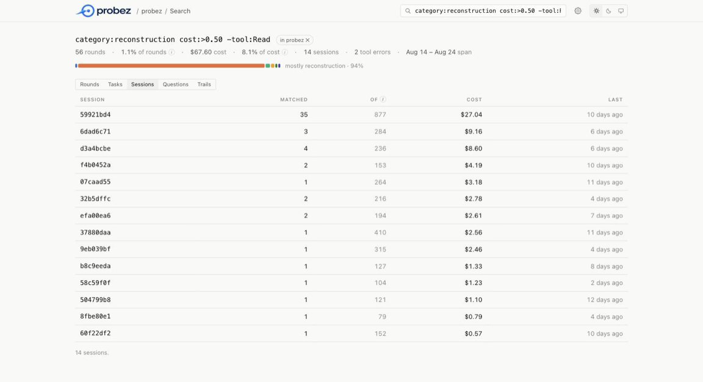

<p align="center">
  <picture>
    <source media="(prefers-color-scheme: dark)" srcset="docs/logo-dark.png">
    
  </picture>
</p>

<p align="center">
  <a href="https://www.npmjs.com/package/probez-cli"></a>
  <a href="https://github.com/flowzhq/probez/actions/workflows/ci.yml"></a>
  <a href="https://nodejs.org"></a>
  <a href="LICENSE"></a>
</p>

<p align="center">
  <strong>See what your coding agents actually did. Every session, measured locally.</strong>
</p>

Coding agents already log every session: each LLM call, every tool invocation, the timing between.
probez normalizes that into one record per LLM round and shows you where the work — and the money —
actually went. Nothing leaves your machine.

## Quick start

**1. Install.** Needs **Node 20+** and nothing else — zero runtime dependencies.

```bash
npm install -g probez-cli
```

Or skip the install and put `npx probez-cli` wherever `probez` appears below.

**2. Collect a project you work in.** Nothing to set up first: the history is already on disk, so
the first run reads months of sessions you have already had.

```bash
cd ~/any/project-you-work-in
probez collect
```

It reads [Claude Code](https://claude.com/claude-code) sessions from `~/.claude/projects`, [Cursor](https://cursor.com) transcripts from `~/.cursor/projects`, and [Codex](https://github.com/openai/codex) CLI rollouts from `~/.codex/sessions` (or `$CODEX_HOME/sessions`), then writes
one record per LLM round under `~/.probez`. Run it again whenever you want to catch up — it reads
only what changed. `probez collect --all` does every project on the machine at once, and a
project it cannot collect is reported and stepped over rather than ending the run — the others are
still collected, and the command exits non-zero. A repository
used in more than one agent is one project. Cursor transcripts do not include token usage, so those rounds
have no cost. Each round records which product produced it; filter with `--source` or `source:` rather than
treating agents as separate projects.

**3. Look at what came back**, in the browser or in the terminal:

```bash
probez view   # the profiler: projects, sessions, tasks, rounds
probez        # the project as one summary — it collects first, so it stands in for step 2
```

Both are below: [the view](#the-view) first, [the CLI](#the-cli) after.

## The view

`probez view` opens a local profiler in your browser: every project, then a session, then a task,
down to a single tool call. It listens on `127.0.0.1` with a token that is new on every run.

**Search** — one query bar, on every page. `/` or ⌘K focuses it; it completes fields from the same
table the parser validates against, and their values from what the store actually holds, with the
count beside each. What comes back leads with the share rather than the row count: 56 rounds is a
number, 8.1% of what this project cost is a finding. The tabs say what the matched rounds are then
counted as — a session matches when a round inside it does, and the row reports the rounds that
matched with the size of the whole session beside them.

<p align="center">
  
</p>

The box has two modes, shown at its head: **search**, which takes a query, and **ask**, which hands
what you typed to your own LLM as a question and puts the query it wrote into the bar to be checked
and edited. Two controls rather than one that changes meaning, because one of them spends tokens on
somebody else's program. The result is an ordinary search URL either way, so it is shareable and
re-runnable by anyone with no LLM configured.

Clicking a round opens its task with the query still in the URL, so the trace arrives with the
rounds that matched lit and the rest of the task drawn around them — the point being *where in the
task* the matches fall, which a filtered list cannot show. The bar starts scoped to whatever page
you were on; the chip beside the query is what widens it to the whole store. The Source control
next to the bar filters the page you are on — same project, that agent's sessions. Typing
`source:claude` (or cursor, or codex) in the query bar is still a search. Neither changes what Sync
collects.

**A project** — where its work went, what each kind of work cost, and the sessions it happened in.
The list under it is three tabs: *sessions*, each row carrying the whole spread of its work as a bar
rather than the name of its largest slice; *trails*, every trail the project made through itself; and
*questions*, everything it needed to know and what each answer cost. Either kind of row opens the
task it happened in, with the trail or the question already open on the round it started at.

<p align="center">
  
</p>

**A session** — the trace. Two rows over one axis: the phases the agent moved through, and the
rounds themselves, each stacked by the work it did. Click a round to open it in full — what it was
asked, what it said, and every tool call marked with the work it was counted as; the arrow keys walk
to the next. Opening a call shows the arguments it was given, and **Show result** reads what came
back out of the archived session — fetched when you ask for it, not when the page loads. A round
also says how full the model's context window its input was — green to 20%, amber to 80%, red above
it — and a round that followed an auto-compaction is drawn under a rule saying what was dropped and
how long it took.

<p align="center">
  
</p>

A task's trace has a third row between the two, when the task made any: brackets over the rounds
they touched, drawing either the **trails** or the **questions** — a toggle beside the axis, when
there is both to see. Neither is a stretch of rounds. A trail is what the evidence connects, so a
search interrupted by an edit and resumed four rounds later is still one search; a question is what
chased one word, so a grep run for the sixth time is still that question. The phase ribbon can show
neither. Hover a bracket for what it did and what it cost, click it to light up the rounds it
touched, and read it call by call underneath.

One lane and not two, because the two readings cover much the same rounds and stacking them would
put two near-identical bars over one strip. Hatching means the same thing in both — part of this
went nowhere: a trail that changed nothing, a question part of which was asking again. A question
answered in one call is a point rather than a span, so it gets no bracket; the note under the trace
says how many are not drawn.

Under the trace, **what it needed to know**: the same calls read the other way. A trail is what
followed something; a question is what was being asked, including the asking that got nowhere — and
since a trail's hops exist only where a call narrowed, a call that asks the same thing over again
appears in no trail at all. Clicking a question lights the rounds it touched and lists every call it
took, with `↺` against the ones that asked what had already been asked. Questions answered in a
single call are counted under the table rather than listed in it. **Explain** on any one of them
hands its calls to your own LLM and puts back the sentence it was after, beside the measured kind
rather than over it; from then on the table shows the sentence in place of the search terms. See
`probez questions` and `probez explain` below.

Three things worth knowing:

- **The axis is round index, with time as a toggle.** On a time axis the slowest round dwarfs the
  rest, so most collapse into slivers you cannot click. `working` is the time the model spent
  generating; `elapsed` adds the tools it waited on and the turns it waited on you.
- **Phases are smoothed over five rounds**, and the page says so. The raw per-round category gives
  a band every round or two, which is a barcode rather than a story. Every cell still shows what
  its own round actually was.
- **Rounds no tool saw are drawn hatched**, not dropped. They carry no label and sit outside every
  share, but a timeline missing 5% of its rounds would lie about how long the task took.

**What this machine calls things.** probez classifies a command by name, and it only ever sees the
last part of a path — a repository's own `bin/check` arrives as `check`. A name that generic cannot go in
the table probez ships, where it would relabel an unrelated `check` on somebody else's machine, so
Settings has a list of the commands *this store has run and nothing has classified*, most-used
first, and a kind to give each. It is stored in `~/.probez/commands.json` and read over the shipped
table, so it can correct a name as well as add one. Anything left unnamed stays unclassified, which
is reported rather than guessed at.

**Settings** holds the token rates every cost is computed from — one row per model, five rates
each, at published list prices and yours to change. Stored in `~/.probez/pricing.json`, owner-only,
and read *over* the shipped table rather than instead of it: correcting one rate leaves the rest
free to move when a later probez ships a new model, while a row you empty stays empty. A model id
matches past a dated suffix, so a rate against `claude-haiku-4-5` also covers the
`claude-haiku-4-5-20251001` rounds Claude Code actually records — and no further than that, so a
model nothing has priced is reported as unpriced instead of billed at a lookalike's rate.
Under them sits the **reader**: the command *explain* runs, and the only program probez starts at
your direction. It is argv and not a shell line, it runs only when you press explain on one question
or *ask* on a search, and leaving it blank leaves probez with nothing it could run. One other program
probez starts, and it is not one you configure: `git log`, during collection, in a project whose
reflog cannot say what a task began from — read-only and local, described under
[Privacy](#privacy).

At the bottom, behind its own heading, is the **danger zone**: the two operations that remove more
than one project. *Trim old history* takes every session older than a window you pick, and the
archived transcripts beside them; *clear the whole store* takes every project. Neither acts on its
first press — both show what would go, the largest projects named rather than only counted, in a
panel you have to open. Your rates and your reader are settings rather than projects and stay.

The **projects list** is ordered newest-activity-first, and its **Project**, **Last activity** and
**Updated** headings sort it. The last two are different questions and both are on the page: *Last
activity* is when the most recent round in a project ran, and *Updated* is when probez last went and
looked — collected here, or imported from a file. Sorting by *Updated* is how you find the projects
you have not synced lately, which is not a thing the work dates can tell you. A project with no date
sorts last whichever way the arrow points, since an unknown date is not an old one.

Its **Work** column is the same pair the project page draws, at row size: the bar is the mix of work
by rounds, and under it is the largest of those with what that work cost — the number the project
page shows in its *Share* column, so the two say the same thing about the same project. A project
none of whose models has a rate has no money to divide; its share is of the rounds instead, and the
row says so rather than letting one figure stand for two different denominators. Between the two
there is a project where *most* of the work is unpriced — an imported store where half the rounds
recorded no model, say. A share of money is still the better answer there, but it is an answer
about the priced half, so the row and the project page's *Share* heading both carry a mark saying
how many rounds the money covers.

Each project carries a **⋮** menu, on its own page and on every row of the projects list. *Sync*
runs `collect` then `analyze` for that project, and is on a session page too, beside the header — a
run you are still reading is where you notice the agent has kept working, and there is no smaller
sync to offer there, since an agent writes its log per project and `collect` reads all of it.
*Rename* gives it a name of your own — a label, on this machine, that the CLI answers to as well;
nothing moves, since a project's directory in the store is a hash of the path an agent ran in, and
clearing the field puts the derived name back.
*Export* hands its rounds or a full bundle to your browser to save, and *Darken the export* above
those two decides what either one writes — on, the prompts and paths go out replaced and the figures
go out whole, which is what makes a project safe to send to somebody outside the work. It changes
the file and only the file; the screen goes on showing your own work in full, which is what it is
for. Both export rows read *darkened* while it is on, so a toggle whose effect lands in a file you
have not written yet still shows you something. *Delete*
removes the project and
everything probez recorded for it, after asking; the agent's own session files are not touched, so a
collected project comes back with `probez collect` minus whatever the agent has since pruned, and an
imported one does not come back at all. **Import** on the projects page reads a file someone sent
you — which is also why the view opens on an empty store, and why a project that arrived that way is
marked `imported` in the list, and `darkened` beside it when it came in redacted.

## The CLI

Everything the view shows, one table at a time. The levels nest, and every level has a name you can
type back:

```
project                a directory an agent was started in    its name, or its path
└─ session             one agent run                          504799b8
   ├─ subagent         one run the agent handed off           504799b8/a8261ff4
   └─ task             a user turn, and everything it led to  504799b8#3
      └─ round         one LLM call                           504799b8#3.12
         └─ tool call                                         shown in full by its round
```

| Command | What it does |
| --- | --- |
| `probez [project]` | Collect, then summarize |
| `probez projects` | Every project on this machine |
| `probez sessions` · `session <id>` | One row per session, or one session as its tasks |
| `probez tasks` · `task <id>` | One row per task, or one task and every round it took |
| `probez rounds` · `round <id>` | One row per round, or one round with every tool call |
| `probez tools` | Every tool called, and what `Bash` actually ran |
| `probez trails` · `trail <id>` | Runs of calls that followed one another into the repository |
| `probez questions` · `question <id>` | What the agent needed to know, and what finding out cost |
| `probez explain <id>` | Ask your own LLM what one question was, in a sentence |
| `probez find "<query>"` | One query over everything collected, or `--ask` a question |
| `probez analyze` | Where the work went |
| `probez view` | Open the profiler |
| `probez collect` | Collect one project, or every project under a folder |
| `probez export <project>` | Write a project out as a file to send someone, `--darken` to redact it |
| `probez import <file>` | Read a project someone sent you |
| `probez clear` | Remove a project, everything, or everything older than a window |

Lists take `--limit` and always say how many rows they withheld. `rounds` filters by `--session`,
`--task`, `--tool`, `--command`, `--kind`, `--category`, `--target`, `--agent` and `--errors`, and
`sessions` takes `--agent` too. `find` takes `--all`, `--in`, `--sort`, `--plan`, `--ask`, `--prompt` and `--again`.
`analyze` takes `--by`, `--split` and `--unclassified`. `trails` takes `--deep`, `--min-depth` and
`--outcome`. `questions` takes `--kind` and `--min-calls`, and `explain` takes `--again` and `--prompt`.
`clear` takes `--all`, `--before` and `--yes`, and `collect` takes `--since`.
`export` takes `--bundle`, `--darken` and `--out`, and `import` takes `--as`.
`--source` on `collect` and `projects` selects which agent directories to scan (Claude Code, Cursor,
Codex, or all). On the read commands — `sessions`, `tasks`, `rounds`, `analyze`, `tools`, `find`,
`trails`, `questions`, `view` — the same flag filters already-collected rounds and does not restrict
discovery. `source:claude` is that filter in a query, and matches persisted `claude-code`. `--json`
works everywhere. `probez --help` lists every flag under the command it belongs to.

```console
$ probez

probez  flowz-agentic-sdlc  ~/Dev/workspace/flowz-agentic-sdlc

  sessions   27        rounds   3922     tasks  161
  tokens     1.3B in · 3.2M out
             19.4K new · 18.4M cached · 1.3B reused  (99% reused)
  span       Jul 31 – Aug 31, 2026
  top tools  Bash 2687 · Edit 1121 · Write 330 · Read 294 · WebSearch 28

  up to date, 10 sessions unchanged
  → ~/.probez/projects/flowz-agentic-sdlc-bd3def99/rounds.jsonl
```

Sessions of a project, newest last:

```console
$ probez sessions flowz-mcp

  flowz-mcp  ~/Dev/workspace/flowz-mcp

  SESSION    SOURCE   ROUNDS  TASKS  TOOLS           IN      OUT       COST  WORK       LAST
  0bfa7fe3   claude      127      5  122 ✗1       21.6M   186.4K     $18.08  Impl 37%   29 days ago
  0b2cc149   claude       87      4  84 ✗2        10.1M    97.6K      $9.18  Impl 38%   29 days ago
  51cced08   claude      134      4  131          24.3M   138.1K     $22.57  Impl 39%   28 days ago
  be254122   claude       21      2  19 ✗1         1.0M     8.2K      $1.08  Recon 55%  28 days ago
  bfd594d9   claude       73      2  72 ✗1        10.4M    74.6K      $8.87  Recon 34%  28 days ago
  6ffef9bc   claude       33      4  30            2.2M    17.5K      $2.19  Recon 52%  24 days ago
  c21c7448   claude      146      2  145 ✗4       22.8M   112.6K     $18.83  Recon 43%  23 days ago
  069d8593   claude       31      1  30 ✗2         1.9M    11.3K      $1.76  Recon 72%  22 days ago

  8 sessions · 652 rounds · $82.58
  `probez session <id>` shows one of them, task by task.
```

When the agent hands work to a subagent, that run is a session of its own, named for the one that
handed it over. It is a separate context with its own model and its own bill, so it is counted
separately rather than folded into the session that delegated it:

```console
$ probez sessions flowz-agentic-sdlc --limit 6

  flowz-agentic-sdlc  ~/Dev/workspace/flowz-agentic-sdlc

  SESSION            AGENT SOURCE   ROUNDS  TASKS  TOOLS           IN      OUT       COST  WORK       LAST
  6b45d8d7/a5420a73  sub   claude        7      1  17          182.4K     5.8K      $0.84  Recon 83%  1 mo ago
  6b45d8d7/ab80aaad  sub   claude        8      1  16          197.9K     5.4K      $0.86  Recon 86%  1 mo ago
  6b45d8d7           main  claude      122      8  234 ✗1       58.6M   139.5K     $76.13  Docs 29%   1 mo ago
  15ac167d/a29da1c6  sub   claude        7      1  19          135.0K     9.1K      $0.94  Recon 93%  1 mo ago
  15ac167d/ad108a22  sub   claude       18      1  38          515.5K    17.7K      $1.99  Plan 65%   1 mo ago
  15ac167d           main  claude      150     16  298 ✗3       27.6M   180.4K     $42.13  Docs 28%   1 mo ago

  showing 6 of 27 sessions · 3922 rounds · $963.20, --limit 0 for all
  `probez session <id>` shows one of them, task by task.
```

`probez session <id>` says underneath a session's own tasks what it handed off, and what that cost:

```console
$ probez session flowz-agentic-sdlc 15ac167d --limit 3

  flowz-agentic-sdlc  ~/Dev/workspace/flowz-agentic-sdlc

  session 15ac167d  ·  16 tasks · 150 rounds · 27.6M in · 180.4K out · 3 tool errors · Jul 31, 2026

  TASK         ROUNDS       IN     OUT     TIME  WORK       FROM     ASKED
  15ac167d#1       12   517.7K   10.8K     2.6m  Docs 55%   a938f1f  start tracking the proje…
  15ac167d#2        5   275.1K    5.9K     1.4m  Docs 75%   6e9716d  once i a while i'll post…
  15ac167d#3        1    58.4K    1.5K    23.8s  —          9e4e660  we are implementing task…

  showing 3 of 16 tasks · 150 rounds, --limit 0 for all. `probez task 15ac167d#1` shows one in full

  handed to 2 subagents · 25 rounds · 650.5K in · 26.7K out, none of it counted above

  TASK                 ROUNDS       IN     OUT     TIME  WORK       FROM     ASKED
  15ac167d/a29da1c6#1       7   135.0K    9.1K     2.1m  Recon 93%  9e4e660  Decompose PRD-001 (…
  15ac167d/ad108a22#1      18   515.5K   17.7K     4.0m  Plan 65%   a1b59fd  Audit this repo's S…
```

A session as its tasks, each with the commit the tree was on when it was asked:

```console
$ probez tasks flowz-agentic-sdlc --session 15ac167d --limit 8

  flowz-agentic-sdlc  ~/Dev/workspace/flowz-agentic-sdlc

  TASK         ROUNDS       IN     OUT     TIME  WORK       FROM     ASKED
  15ac167d#1       12   517.7K   10.8K     2.6m  Docs 55%   a938f1f  start tracking the proje…
  15ac167d#2        5   275.1K    5.9K     1.4m  Docs 75%   6e9716d  once i a while i'll post…
  15ac167d#3        1    58.4K    1.5K    23.8s  —          9e4e660  we are implementing task…
  15ac167d#4        3   186.2K    3.4K    51.7s  Plan 100%  9e4e660  what next? M2?
  15ac167d#5        3   215.4K    6.9K     1.3m  Docs 50%   9e4e660  do we have this in the d…
  15ac167d#6        4   307.5K    3.0K    41.9s  Docs 67%   2a0c9e7  this should be in the co…
  15ac167d#7       20     2.1M   36.2K     7.3m  Docs 46%   be347e3  i see the task, yet no m…
  15ac167d#8        4   569.1K    6.4K     1.5m  Recon 42%  52900e4  add to the metrics ledge…

  showing 8 of 16 tasks, --limit 0 for all. `probez task <id>` shows one in full
```

**`FROM` is where the task began, not what it produced.** Tasks 3, 4 and 5 all start from
`9e4e660`, so those three asks were made against the same tree; the hash then moves, which is the
work of the task before it landing. It is read from git's HEAD reflog when the project is collected,
and it is blank for a project that is not a checkout.

A reflog only reaches so far — git expires it at 90 days, and a fresh clone arrives holding a single
line — so for a task older than that, probez reads the commit history behind it instead, and takes
the newest commit that had been made by the time the task was asked. That second answer is an
inference rather than a record, and it is the one case where `probez` runs `git` rather than reading
a file. It runs only where it can add something: a reflog that still holds the repository's first
commit covers every moment that repository has existed, and nothing else is consulted for one.

And what the work actually was:

```console
$ probez analyze flowz-agentic-sdlc

  flowz-agentic-sdlc  ~/Dev/workspace/flowz-agentic-sdlc

  WORK                  ROUNDS    SHARE      COST  ERRORS      TIME      OUT
  Planning                 203     4.5%    $40.82     2.0      8.1m   116.3K
    read                   171     3.4%    $30.77     2.0      3.2m    73.4K
    clarify               14.0     0.4%     $3.30       ·      2.8m    25.1K
    decompose             10.1     0.5%     $4.24       ·      2.1m    15.4K
    design                 8.0     0.3%     $2.52       ·       1ms     2.4K
  Reconstruction          1440    39.8%   $361.31    83.0     43.3m   963.5K
    locate                 620    16.5%   $149.51    39.0     12.4m   329.1K
    read                   481    12.2%   $110.48    28.0      8.8m   250.5K
    inspect                324    10.8%    $98.32    16.0     21.8m   378.0K
    graph                  9.5     0.2%     $1.86       ·     13.0s     4.6K
    mcp                    6.0     0.1%     $1.14       ·      1.5s     1.3K
  Implementation           867    22.4%   $203.24    10.0      1.2h   973.0K
    modify                 744    17.2%   $156.35     6.0     41.2m   643.0K
    create                 123     5.2%    $46.89     4.0     30.2m   330.0K
  Testing                  322     7.9%    $71.88    13.0      5.5m   139.1K
    run                    182     4.8%    $43.21    10.0      4.5m   105.7K
    test                   140     3.2%    $28.67     3.0      1.0m    33.4K
  Documentation            496    12.6%   $114.28     6.0     47.4m   561.6K
    system                 437    10.5%    $94.90     6.0     41.2m   487.0K
    agent                 55.9     2.1%    $18.94       ·      6.2m    70.5K
    change                 3.0     0.0%     $0.44       ·      2.9s     4.1K
  Delivery                 369     9.5%    $85.76    16.0      7.2m   172.1K
    build                  183     4.3%    $39.15     3.0      2.2m    53.1K
    commit                 117     3.2%    $28.70     4.0      2.5m    74.2K
    branch                40.3     1.4%    $12.55     8.0      1.5m    29.9K
    publish               29.5     0.6%     $5.36     1.0     58.4s    14.8K
  Environment             34.7     2.1%    $18.66       ·     58.1s    20.2K
    env                   29.3     1.9%    $17.45       ·     52.1s    18.5K
    deps                   5.4     0.1%     $1.21       ·      6.0s     1.7K
  Unclassified            37.7     1.3%    $11.50       ·      1.3m    31.3K
    unknown               30.7     1.1%    $10.04       ·      1.1m    23.6K
    incidental             7.0     0.2%     $1.46       ·     17.3s     7.7K

  3770 rounds did something a tool can see, out of 3922. Shares are of the $907.47 they cost
  152 rounds of prose only (3.9%) · 1.0% unclassified · 70.8% of work has a known target
  Unclassified is mostly ToolSearch, pnpm, Skill. --unclassified lists it
  22.5% of the finding was inside 76 trails, 40 of which ended in a change
  The deepest went 5 hops from a listing: `probez trail b2922aea#2.66`
```

**A share is a share of money.** `ROUNDS` says how much of the work a category was; `SHARE` says how
much of the bill. Cost is worked out per round from its own model's rates, then split across that
round's work. The last lines are part of the answer: rounds of pure prose and tools with no entry in
the table sit outside the shares, and are reported rather than guessed at.

Where *nothing* is priced there is no bill to divide — a Cursor transcript records no token counts at
all — so `SHARE` falls back to the share of the rounds and the coverage line says which of the two
you are reading. Set a rate under Settings and it goes back to being a share of money.

### Search: one query over everything

Every table above answers one question through a fixed hole — one flag per field, and no way to
combine two of them. `probez find` is the other direction: one grammar over the whole record, so a
question that crosses two levels can be written down.

Bare words are free text, over the prompts, the prose, the commands and the paths. A `key:value`
filters, `-` negates, one after another means and, `OR` is the other one, and brackets regroup.

```console
$ probez find 'category:reconstruction cost:>0.30 -tool:Read' flowz-mcp

  flowz-mcp  ~/Dev/workspace/flowz-mcp

  4 rounds · $2.32 · 0.6% of rounds · 2.8% of cost · 3 sessions · 83% reconstruction

  ROUND           WORK                COST     TIME         WHEN  SAYS
  c21c7448#2.64   Environment        $1.16    842ms  23 days ago  Bash 1
  c21c7448#1.0    Reconstruction     $0.39     1.5s  24 days ago  implement next task
  bfd594d9#2.24   Reconstruction     $0.42    866ms  28 days ago  Bash 1
  0b2cc149#1.0    Reconstruction     $0.36    794ms  29 days ago  did we implemented T001?

  4 rounds
```

**The first line is a share, not a count.** Four rounds is a number; 2.8% of what this project cost
is a finding. A query does not filter a listing, it re-scopes the profile — the same idea as pprof's
`-focus`, and the reason the totals, the concentration and the distribution come before any row of
it.

`--in` says what the matched rounds are then counted as. A session, task or project matches when a
round inside it does, and the row reports the rounds that matched with the size of the whole thing
beside them, so a task that spent six of its seventy-one rounds on what was asked for reads as six:

```console
$ probez find '(tool:Edit OR tool:Write) added:>200 in:tasks sort:cost' flowz-agentic-sdlc --limit 5

  flowz-agentic-sdlc  ~/Dev/workspace/flowz-agentic-sdlc

  29 rounds · $11.87 · 0.7% of rounds · 1.2% of cost · 8 sessions · 86% implementation

  TASK         ROUNDS    OF       COST  ASKED
  6b45d8d7#3        6    71      $4.10  <task-notification> <task-id>a5420a731e4ed3f58</task…
  5366f0e4#2        6   164      $2.36  Base directory for this skill: /private/tmp/claude-5…
  f77c95fe#1        4   182      $1.32  implement PRD13
  5366f0e4#22       3    35      $0.73  2 - this is not yet to be enforced - i have free tei…
  ea20e02d#3        1     9      $0.50  do it

  showing 5 of 14 tasks, --limit 0 for all
```

`--all` searches every project in the store rather than one. `sort:` puts the big end of a magnitude
first, `limit:` and `in:` can be written into the query instead of passed as flags, and `--json`
carries the whole result — totals, share, distribution and rows.

**A half-typed query is read the same way a finished one is.** What cannot be read yet is said,
under the part of the query it is about, and everything else still runs; a value that is merely
missing narrows nothing rather than blanking the list. `--plan` prints that reading on its own,
which is a way to find out what probez made of a query without it going near a store:

```console
$ probez find 'cost:> categoy:test' --plan

  cost:> categoy:test
  ^^^^^^
  `cost:` needs a value
         ^^^^^^^^^^^^
  there is no `categoy:` field, so this is being searched for as text — did you mean category:?


  read as   categoy:test
  counting  rounds
  fields    ·
  sort      newest first
  limit     50
```

**Or don't learn the language.** `--ask` hands your question to the LLM you already have and gets
back a *query* — which probez parses, refuses outright if it does not read, prints, and only then
answers the same way it answers one you typed:

```console
$ probez find --ask 'which sessions had the most failing shell commands' flowz-mcp

  probez read "which sessions had the most failing shell commands" as

    tool:Bash is:error in:sessions sort:errors

  claude: "failing shell commands" reads as rounds whose Bash calls the harness reported
  as failed, grouped by session and ranked by error count — the language can't tie the
  error to the Bash call specifically, only to the round

  Run the query above to answer this again without asking.

  flowz-mcp  ~/Dev/workspace/flowz-mcp

  6 rounds · $0.54 · 0.9% of rounds · 0.6% of cost · 5 sessions · 6 tool errors · 50% reconstruction

  SESSION      ROUNDS     OF       COST     TIME  LAST
  069d8593          2     31      $0.12    12.2s  20 days ago
  0bfa7fe3          1    127      $0.21    26.5s  27 days ago
  bfd594d9          1     73      $0.11     4.6s  26 days ago
  be254122          1     21      $0.05     2.2s  26 days ago
  0b2cc149          1     87      $0.04     8.2s  27 days ago

  5 sessions
```

**A model chooses which rounds to look at, and never what any of them came to.** Every figure above
is derived from the rounds by the same code that answers a typed query, so the result is re-runnable
by someone with no LLM configured at all and comes out identical — and the query it wrote is one you
can correct by hand. What gets sent is the field table, the values each field can take, and a sample
of the names this store holds; nothing you typed to the agent and nothing any tool returned. It runs
the command in `<data-dir>/reader.json`, the same one [`explain`](#explain-the-same-question-read-back-by-your-own-llm)
uses, and `--prompt` prints exactly what would go while running nothing.

`probez --help` lists every field a query can name, with what each one reads. The filters on
`rounds` are the same language underneath — `--tool Bash` is `tool:Bash`, `--source cursor` is
`source:cursor`, down to the comparison — so the two cannot come to disagree about what a tool name
is or how a command is matched. `source:claude` matches persisted `claude-code`.

**Free text matches a word, or the start of one.** `tok` finds `tokens`; `oken` does not, and
`"npm test"` does not find `pnpm test`. That boundary is what makes the search fast enough to be
worth having: `collect` and `analyze` write a compact index beside the rounds — about a fifth of
their size — holding every field a query can name, so a query is answered from its columns and only
the rounds that actually matched are ever read off disk. On a 93 MB store of 48,000 rounds that is
the difference between 300 ms and 1.4 s across every project at once, and between 60 ms and 260 ms
within one.

The index is derived data in the strict sense: deleting it costs speed and nothing else. A project
that has not been collected since it existed, or whose rounds have moved underneath it, is read in
full and the footer says how many were — since being told is the only way to tell a quick search
from a slow one. `find` itself never writes one; reading writes nothing, here as everywhere.

### Errors: what actually went wrong, and what only looked like it

The harness sets one flag on a failed call, and one flag is the wrong shape for the question. It
fires for a `grep` that matched nothing, for a suite that failed, for an `Edit` whose anchor had
moved, for a plan you rejected, and for an MCP server that was not running. Those are five different
facts and only one of them is a mistake anyone can act on. Counted together they produce an error
rate that cannot come down, because most of what it counts was never wrong.

So every failed call carries a **kind**, read once from the result body at collection and stored as
one word. `error:` filters on it:

| Kind | What it is |
| --- | --- |
| `harness` | the agent misused the tool: an unread file written to, an edit anchor that had moved, a bad argument |
| `exit` | a command the agent ran exited non-zero |
| `limit` | the call hit a tool ceiling: a file too large to return, a `Read` aimed at a directory |
| `schema` | the model's structured output did not satisfy its schema |
| `remote` | an MCP server, a browser or a network call failed |
| `nomatch` | a search or comparison found nothing — an answer, not a failure |
| `denied` | you declined the call, or a permission rule did |
| `other` | flagged, and not recognised as any of these |

`nomatch` and `denied` are not faults, and are counted apart from the failures everywhere — as
`NOFAULT` in the tools table, as `is:benign` in a query, and outside `errors:` and `is:error`
entirely:

```console
$ probez tools runnerz --limit 3

  runnerz  ~/Dev/benchmarks/runnerz

  TOOL                 CALLS  ERRORS  NOFAULT    RESULT      TIME
  Bash                  2602      60       3      3.8M     14.6h
    cd                  1378      30       ·      1.6M      6.9h
    echo                1042      27       2      1.6M      5.0h
    grep                 734      11       2    897.0K      6.5h
      … 130 more, --limit 0 for all
  Edit                   133       6       ·     21.8K      5.8m
  Read                    46       ·       ·    460.2K      2.1m
  AskUserQuestion         19       ·       ·     10.3K      3.7h
  ToolSearch              16       ·       ·      1.2K      1.9s
  Write                   12       ·       ·      2.0K     20.2s
  ExitPlanMode             9       ·       6     45.9K      1.1h
  TaskOutput               6       ·       ·      5.4K     47.7m
  ListAgents               5       ·       ·      3.2K     108ms
  Agent                    3       ·       ·      3.2K      50ms
  Monitor                  3       ·       ·       627      91ms
  TaskStop                 3       ·       ·      1.6K      24ms
  WebFetch                 3       ·       ·      4.9K     34.7s
  WebSearch                3       ·       ·     11.0K     35.0s
  EnterPlanMode            2       ·       ·      1.2K      11ms
  Skill                    1       ·       ·        27      3.0s

  16 tools · 2866 calls · 66 errors
  9 more flagged with no fault: a search found nothing, or you said no
  133 commands under Bash. A call that ran several is counted for each
```

`ExitPlanMode` is the clearest case: nine calls, no errors, six plans you turned down. Under one
flag that read as a tool failing two times in three.

The kind worth chasing is `harness`, because every one of them is a protocol mistake with a fix —
`probez find "error:harness" --all` is the list. `exit` is the agent's shell reporting on the world
and mostly says what the repository was doing, not what the agent did wrong.

**What this cannot see.** Cursor records a tool result as a name and nothing else — no body, no
status, no flag — so every error question comes back empty for a Cursor session rather than wrong.
That is not "no errors"; it is "not recorded", and on a store with Cursor sessions in it that can be
a third of every round. Codex records an exit code and is read the same way Claude Code is.

### Trails: how the agent found its way around

An agent that does not know a repository finds its way around it. It lists the tree, opens what the
listing named, greps for a word, reads the lines the grep hit. Every one of those calls is
Reconstruction, and a tally of Reconstruction cannot tell five hops of one search from five unrelated
file opens. A **trail** is that search:

```console
$ probez trails flowz-agentic-sdlc --deep --limit 8

  flowz-agentic-sdlc  ~/Dev/workspace/flowz-agentic-sdlc

  TRAIL                   STEPS  DEPTH  WIDE  PATHS  ROOT     OUTCOME        IN    TIME
  15ac167d#1.0                8      4     5     10  path     edit       123.0K   15.9s
  15ac167d#9.55              16      6     9     27  listing  edit         1.4M   12.1s
  15ac167d/a29da1c6#1.0       8      2     7      7  listing  abandoned   48.2K    4.9s
  15ac167d/a29da1c6#1.0       5      2     4      4  listing  abandoned   20.3K    3.5s
  15ac167d/ad108a22#1.5       4      2     3      4  doc      abandoned   38.1K    1.4s
  15ac167d/ad108a22#1.5       6      5     2     10  doc      abandoned  200.5K    8.1s
  19ae887e#2.1               13      6     5     11  listing  edit         2.9M   20.1s
  19ae887e#2.6                6      4     3      8  probe    edit         1.8M    9.7s

  showing 8 of 100 trails, --limit 0 for all · 92 proven from result bodies
  `probez trail <id>` draws one of them, hop by hop.
```

`DEPTH` is how far the search went and `WIDE` how far it fanned from a single call — a listing whose
output feeds five reads is wide and shallow, a chain of follows is deep and narrow. `ROOT` is what it
started from and `OUTCOME` whether it ended in a change to somewhere it had been. A trail is named by
the round it starts at, and asking for any round it passed through finds it:

```console
$ probez trail flowz-agentic-sdlc '15ac167d/a29da1c6#1.0' --deep

  trail 15ac167d/a29da1c6#1.0 → 1.4 · 8 steps · proven
  depth 2 · breadth 7 · 7 paths
  from a listing · abandoned · 48.2K in · 1.6K out · 4.9s

  ROUND   REACHED FOLLOWED                CALL
  1.0     tree    started here            Glob packages/**/src/**/*.ts
  1.1     file    listed packages/cont…     Read packages/contracts/src/run.ts
  1.1     file    listed packages/agen…     Read packages/agents/src/provider.ts
  1.1     file    listed packages/agen…     Read packages/agents/src/fake-provider.ts
  1.3     file    listed packages/cont…     Read packages/contracts/src/mission.ts
  1.3     file    listed packages/cont…     Read packages/contracts/src/agent.ts
  1.4     file    listed packages/doma…     Read packages/domain/src/router.ts
  1.4     file    listed packages/cont…     Read packages/contracts/src/common.ts

  `probez round 1.0` shows any one of these calls in full.
```

`CALL` is what actually ran, indented by how deep into the walk it sits, and `FOLLOWED` is the
evidence for each hop. There are three kinds of evidence. `listed` means the path was in
the earlier call's own output, which is proof — and reading it needs the archived session, which is
what `--deep` is for. Without the flag a hop is inferred from what the calls asked for: `probe`, a
search for a word and then a file carrying it, and `narrow`, a file under a directory already
reached. Each trail says which kind it had, on the `proven`/`inferred` line.

The two readings are not two views of one answer. Against probez's own store the deep read finds
about half again as many steps, and it roots a trail further back — the same search the shallow read
names `1.5` is named `1.0` once the listing that started it becomes visible. It is not strictly a
superset either: a better-sourced hop can regroup a trail, and a fragment left under the three-call
floor stops being one.

### Questions: what it needed to know, and what that cost

A trail is a walk that went somewhere. Its edges exist only where a call *narrowed* — a smaller
scope, a file under a directory already reached — so a call that asks the same thing over again
narrows nothing, forms no edge, and joins no trail. In probez's own store a third of all finding is
exactly that, and a tenth of it reaches a trail. The trail keeps the productive hops and drops the
thrash, which is the wrong way round for anyone asking what navigation costs.

A **question** is the other reading of the same calls: one thing the agent needed to know, and every
call it spent finding out, whether or not any of them got anywhere.

```console
$ probez questions flowz-mcp --min-calls 2 --limit 6

  flowz-mcp  ~/Dev/workspace/flowz-mcp

  QUESTION        CALLS  AGAIN  FETCH  GUESS  KIND          IN    TIME  ASKED ABOUT
  51cced08#2.3       11      0     10      0  outline   664.3K    6.5s  claude
  c21c7448#2.13       9      0      8      0  outline   775.9K    3.6s  contextfacets
  c21c7448#2.4        8      0      7      0  outline   484.3K    1.7s  claude
  6ffef9bc#4.17       5      1      2      1  flow      395.1K    3.1s  facets type const confidence …
  069d8593#1.1        4      0      3      0  touches   179.6K    3.8s  —
  be254122#2.15       4      0      3      0  touches   230.2K   682ms  —

  showing 6 of 31 questions, --limit 0 for all
  152 asked in all · 220 calls · 1.45 per question · 31 took more than one
  AGAIN is the same words asked of the same places over again.
  KIND, in these rows:
    outline   what does this file declare
    flow      where does this value travel across layers
    touches   every artifact naming a concept, code and prose alike
  `probez question <id>` shows every call one of them took.
  `probez explain <id>` asks your own LLM what one of them was, in a sentence.
```

`CALLS` is what the question cost. `AGAIN` is the same words asked of the same places over again.
`FETCH` is calls that only turned a line number into a body — the second half of locate-then-fetch,
protocol overhead rather than thinking. `GUESS` is calls that named three or more different words at
once, which is an agent reaching for vocabulary it has not learned yet.

`KIND` is which question it was, decided by the first rule that reads the calls:

| kind | what it stands for |
| --- | --- |
| `define` | show me this symbol's body |
| `refs` | where is this used |
| `outline` | what does this file declare |
| `flow` | where does this value travel across layers |
| `touches` | every artifact naming a concept, code and prose alike |
| `covers` | what constrains this — the tests that exercise it |
| `other` | asked something no rule in the table reads |

The listing prints the ones it used under the table, a detail view glosses the one it is showing,
and `probez questions --help` carries the whole of it — a kind is one word, and one word never says
what it means. There is no `path` — how does A reach B — because no grep expresses that question, so
no reading of a grep can recover it.

A question is named by a round it was asked at, and asking for any round in it finds it:

```console
$ probez question flowz-mcp 0b2cc149#1.2

  question 0b2cc149#1.2 → 1.4 · 3 calls · refs — where is this used
  asked about enqueuer, status
  read as  Where does the Enqueuer exist in this codebase — which internal packages
           reference it, and what do the task docs say about its status?
           touches, not refs · the same concept word "Enqueuer" is swept across all Go
           sources under internal/, plus directory listings of indexer/ and githubapp/ and a
           grep of Status lines in docs/tasks/*.md, gathering code and prose artifacts alike
           rather than a single symbol's callers · claude
  1 place · 1 re-asked · 116.1K in · 508 out · 2.2s

  ROUND   REACHED ASKED                     CALL
  1.2     dir     enqueuer                  ls internal/ && echo "---INDEXER---" && ls in…
  1.3     dir     enqueuer status           grep -rn "Enqueuer" internal/ --include=*.go …
  1.4     dir     enqueuer ↺                grep -rn "Enqueuer" internal/ | head -20; ech…

  `probez round 1.2` shows any one of these calls in full.
```

`CALL` is the command itself, because a run of greps for one word is obvious as a column of
commands and merely plausible as a column of derived labels — the reason there is no separate
`WHERE`, too: a command names its own paths. The `↺` marks a call that asked what the question had
already asked. Three calls, one thing wanted,
and the last of them bought nothing — which is a shape that no trail records, because none of these
three narrowed anything for the next.

### Explain: the same question, read back by your own LLM

`KIND` is a rule, so it holds for six shapes and says `other` for everything else. `explain` is the
sentence instead — and it comes from a model you already have, not from probez.

Write the command in `~/.probez/reader.json`, or set it under **Settings** in the view:

```json
{ "command": ["claude", "-p"] }
```

`["ollama", "run", "llama3"]` works the same way, and so does anything else that reads a prompt on
stdin and prints an answer. Then ask about one question:

```console
$ probez explain flowz-mcp 0b2cc149#1.2

  question 0b2cc149#1.2 → 1.4 · 3 calls · refs — where is this used
  asked about enqueuer, status
  read as  Where does the Enqueuer exist in this codebase — which internal packages
           reference it, and what do the task docs say about its status?
           touches, not refs · the same concept word "Enqueuer" is swept across all Go
           sources under internal/, plus directory listings of indexer/ and githubapp/ and a
           grep of Status lines in docs/tasks/*.md, gathering code and prose artifacts alike
           rather than a single symbol's callers · claude
  1 place · 1 re-asked · 116.1K in · 508 out · 2.2s

  ROUND   REACHED ASKED                     CALL
  1.2     dir     enqueuer                  ls internal/ && echo "---INDEXER---" && ls in…
  1.3     dir     enqueuer status           grep -rn "Enqueuer" internal/ --include=*.go …
  1.4     dir     enqueuer ↺                grep -rn "Enqueuer" internal/ | head -20; ech…

  `probez round 1.2` shows any one of these calls in full.
```

The reading sits *beside* the measurement and never replaces it: the header still says `refs`,
because that is what the rule reads off these three calls, and the model's `touches` is printed as a
disagreement rather than as a correction. Nothing that comes back enters a share, a tally or a
filter — every number probez prints stays derivable from the rounds alone. The answer is kept beside
that project's rounds, so `probez question 0b2cc149#1.2` shows it too and asking again runs nothing;
`--again` is what spends.

In the view it is a button on any question, and the sentence then fills the *asked about* column so
a table of them can be read at a glance. Beside it is **copy prompt**, which puts exactly what the
reader would be sent on the clipboard — the same text `--prompt` prints — so you can paste it into
a chat you already have open. It runs nothing and needs no reader, so it is there whether or not one
is configured.

What this costs is worth being exact about, because probez otherwise opens no connection to
anything:

- probez still opens no socket. It runs the command you named, as you, and whatever that command
  talks to it talks to with your credentials. probez holds no API key.
- The command is argv and never goes through a shell.
- It runs when you ask, on the question you asked about. Collecting, analyzing and browsing run
  nothing, and with no `reader.json` there is nothing probez can run at all.
- What is sent is that question's calls — the words searched for, the paths named, the command as it
  ran — and nothing else. No prompts you typed, no assistant text, no tool output.
  `probez explain <id> --prompt` prints exactly what would go and runs nothing, which is also how to
  use this without probez spawning anything; *copy prompt* in the view is the same text on the
  clipboard, to paste wherever you like.

Those calls are still your data, and a shell command can hold a path or a secret you typed. A hosted
model sends them off the machine; a local one does not. That choice is the command in the file.

Any single round opens in full, down to what each tool was given:

```console
$ probez round flowz-mcp 0bfa7fe3#1.36

  round 0bfa7fe3#1.36 · main · opus-5
  124.0K in · 121 out · 825ms · 0 thinking chars  (12% of context)
  2 new · 10.3K cached · 113.8K reused
  generated in 3.4s
  session 0bfa7fe3-f9c1-448f-bbac-a4c58b85e5bf · 2026-08-11T18:08:24.141Z

  assistant
    Build and vet are clean. Running the tests:

  tools (1)
     1    Bash             9.4s  848 chars
       testing/test
       command: go test ./... 2>&1 | tail -40
       description: Run the full test suite
```

A session that filled its window carries the one discontinuity a session file does not announce by
ending. `/clear` starts a new session, so it needs no marking; an auto-compaction keeps the same id
and the same file, drops most of the context, and carries on. Every round says what share of its
model's window its input filled — `995.2K in · 4.6K out · 1.2m  (100% of context)` on the last round
before one — and the round after it opens on a rule naming what was dropped:
`── compacted (auto) · 1.0M → 21.0K · took 2.6m ──`. No block is pasted for it here because the
round after a compaction carries the whole continuation summary as its prompt, and printing one runs
to several hundred lines.

## Clearing what you no longer need

A store grows. Almost all of it is the verbatim copies of the agent's own transcripts kept beside
the rounds — on the machine this was written on, 830 MB of 977 — so trimming those is what actually
gives the disk back.

```console
$ probez clear --before 14d

  would remove everything last active before 2026-08-13:

  flowz-agentic-sdlc       all of it   3744 rounds     55 MB
  flowz-mcp               5 sessions    442 rounds      6 MB

  2 projects touched · 1 removed entirely · 29 sessions · 4186 rounds · 61 MB freed

  The agent's own session files are not touched, so `probez collect` brings back
  whatever the agent still has. An imported project does not come back.

  Remove 4186 rounds from 2 projects? There is no undo. [y/N]
```

**A session is the unit.** One whose last round is older than the window goes entirely, with the
archived transcript beside it; one with any newer round stays whole. So a project you still work in
keeps its recent work and gives up the rest, and a project you have not touched in months goes.
`probez clear --all` takes everything; `probez clear <project>` takes one.

**Nothing acts on the first press.** The plan above is printed and then asked about, and with no
terminal to ask on — a pipe, a CI job — it refuses rather than assuming, so `--yes` is how a script
says it means it. The same two operations sit under *Danger zone* in `probez view` → Settings,
where the panel names the largest projects rather than only counting them.

**What is gone is only as recoverable as the agent's own files.** probez has only ever read those,
so `probez collect` brings back whatever the agent still has — and a session cleared from the store
is not remembered as cleared, so an unrestricted collect brings that back too. If what you want is a
store that stays small, `probez collect --since 30d` is the companion: it reads only the sessions
the agent has written to inside a window, and a later collect with no window still picks up the
rest. An imported project does not come back: the file it arrived as is the only other copy.

## Sharing a project

A project can be written to a file and read back on another machine, so a trace can go in a bug
report or a review the way a log does.

```console
$ probez export flowz-mcp --bundle --out flowz-mcp.json

  exported  flowz-mcp  →  ~/probez-demo/flowz-mcp.json
  1448 KB · they read it with `probez import flowz-mcp.json`
```

```console
$ probez import flowz-mcp.json

  imported  flowz-mcp

  sessions   8         rounds   652      tasks  24

  this is somebody else's work, kept apart from anything collected here
  → ~/.probez/projects/flowz-mcp-34f11966/rounds.jsonl
  probez view flowz-mcp-34f11966
```

`--bundle` writes one `.json` carrying the manifest and the analysis around the rounds; without it
you get the store's own `.jsonl`, one round per line, on stdout unless you pass `--out`. Either
imports. The same pair is in the view: **Export** under a project's **⋮**, **Import** on the
projects page.

**`--darken` is how you send one to somebody outside the work.** Prompts and replies are written as
`****`; paths, commands and search terms become tokens; the project's own name goes with them. What
survives is every measurement — rounds, tasks, tokens, cost, timing, errors — and, deliberately, the
shape the analyzer reads: a path still resolves to the same target, a command still classifies as
the same kind of work, and two calls that named the same file still name the same token, so the
categories, the targets and the trails all come out. In the view it is **Darken the export**, a
toggle above the two Export items, since it changes what either one writes rather than being a third
thing to export. It redacts the file and nothing else — the view keeps showing your own work as it
is.

```console
$ probez export flowz-mcp --bundle --darken --out flowz-mcp-darkened.json

  exported  darkened  flowz-mcp  →  ~/probez-demo/flowz-mcp-darkened.json
  1202 KB · they read it with `probez import flowz-mcp-darkened.json`
```

It cannot be undone: the tokens are one-way and salted per export, so two exports of the same
project share none of them. A project that arrived this way says `darkened` in `probez projects`, in
the header of every read command, and beside its name in the view. Two things it does not do, which
are worth knowing before you rely on it: the counts still describe real work, so a small project's
shape may be recognisable to someone who knows it; and trails come out thinner, because an edge
built from a search term appearing *inside* a file's name cannot survive a one-way token — on this
repo's own store, 101 trails against 146.

An import is kept apart from anything collected here — a hash of the sender's project decides where
it lands, so the same name from two people does not collide, and re-importing replaces rather than
appends. Nothing in a file is executed. But nothing in it is checked either: it says whatever the
sender's agent said, and probez shows it to you as faithfully as it shows your own work. **An export
is unredacted unless it was darkened** — otherwise it holds prompts, shell commands and file paths
exactly as typed. Read one before you send it, and read [SECURITY.md](SECURITY.md) first.

## What you get

One JSON object per LLM round, appended to `~/.probez/projects/<project>/rounds.jsonl`:

```json
{
  "session": "0bfa7fe3-f9c1-448f-bbac-a4c58b85e5bf",
  "round": 87, "task": 3, "commit": null, "agent": "main", "source": "claude-code",
  "id": "msg_011CdwSqg3tdZwYQ7vw69XdB",
  "ts": "2026-08-11T18:37:28.976Z", "ms": 12571, "gen_ms": 16407, "wait_ms": null,
  "first_input": "tool_result",
  "model": "claude-opus-5",
  "in_tokens": 208130, "in_uncached": 1, "in_cache_read": 207020,
  "in_cache_write": 1109, "in_cache_write_5m": 0, "in_cache_write_1h": 1109,
  "out_tokens": 1307,
  "mcp_server": null, "mcp_tool": null, "skill": null,
  "user_text": "",
  "text": "Now the composer becomes a merger rather than the sole producer:",
  "thinking_chars": 0,
  "tools": [
    {"name": "Edit", "id": "toolu_01JSLS17DXQPPbbA1Qj1W5vS",
     "input": {"file_path": "internal/compose/composer.go", "old_string": "func hasUnresolved…"},
     "input_chars": 3045, "result_chars": 175,
     "is_error": false, "stderr_chars": null, "interrupted": null,
     "patch": {"files": 1, "added": 76, "removed": 0},
     "emitted_at": "2026-08-11T18:37:41.547Z", "result_at": "2026-08-11T18:37:41.647Z", "ms": 100}
  ],
  "events": [
    {"type": "tool_result", "ts": "2026-08-11T18:37:25.140Z", "chars": 315,
     "tool_call_id": "toolu_01RvZYdDLoxC9ybqoKZ4RSjD"},
    {"type": "text", "ts": "2026-08-11T18:37:28.976Z", "chars": 64},
    {"type": "tool_call", "ts": "2026-08-11T18:37:41.547Z",
     "tool_call_id": "toolu_01JSLS17DXQPPbbA1Qj1W5vS"}
  ]
}
```

Five of those repay a second look:

- **`in_tokens` is the sum of the fields after it**, and the last is usually almost all of it. Cache
  reads bill at a fraction of the rate, so the total alone is a poor guide to what a round cost.
- **`ms` is not how long the round took.** It spans the records the round wrote; `gen_ms` starts
  from the input that prompted it, so it includes the wait before the model said anything.
- **`is_error` is the harness's flag**, meaning the call was accepted — a `Bash` call whose test
  suite fails still comes back `false`. `stderr_chars` and `interrupted` are what actually happened.
- **`commit` is the task's starting point, at full length**, and it is the same on every round of
  the task. It is `null` here because the project this round came from is not a git checkout, which
  is also what a task older than the repository's first commit, and a repository neither the reflog
  nor the commit history can be read from, both look like.
- **`darkened` is absent here, and is `true` on every round of a project that arrived darkened** —
  see [Sharing a project](#sharing-a-project). It rides on the round rather than beside it because
  a `.jsonl` export has no manifest to carry it, so the mark survives a file someone cut down by
  hand. Where it is set, the numbers on the round are real and the words are `****` or tokens.

**Not recorded:** reasoning text and tool result bodies, kept as character counts. Tool input
strings over 2,000 characters are cut to the first 200 plus a length marker; object structure and
every file path survives, and `input_chars` carries the size the cut removed.

A verbatim copy of each session file is kept alongside, so nothing is lost if you later want a field
probez does not normalize — and it is what a schema change rebuilds from. It is also where `view`
reads a result body from when you press **Show result**, which is why that works on a project
collected here and not on one that arrived as an export. Collecting every project
on a machine with a year of history took about 305 MB, of which the session copies were 284 MB and
the normalized rounds 30 MB.

Two derived files sit beside the rounds, and both are caches: `analysis.jsonl`, which `analyze`
rebuilds from the rounds every time it runs, and `readings.json`, which holds what a reader answered
about the questions you asked it about. Deleting either loses nothing that cannot be produced again
— though a reading costs a model call to produce, which is why it is kept at all.

## Privacy

**probez sends nothing anywhere, unless you configure a reader and press explain.** No network
calls, no telemetry, no account, no upload path. Everything stays under `~/.probez` on your machine.
The one exception is [explain](#explain-the-same-question-read-back-by-your-own-llm), which runs a
command you name, on a question you name, with that question's calls and nothing else — and which
does not exist until you write the file.

It does read your real work. `rounds.jsonl` holds prompts and assistant messages in full, and tool
inputs including file paths and shell commands. One repository outside the agent's session directory
is looked into too, for the commit each task started from: `.git/logs/HEAD` in the project, read-only
— and, only where that log does not reach back to the task, one run of `git log` in that directory,
as argv with no shell, taking no lock and writing nothing. Nothing is kept from either but the hash,
and a machine with no git installed behaves exactly as it did before. The verbatim session copies
beside it hold more still: the full reasoning text and full tool output the round record leaves out.

Nothing in the store is redacted. A credential typed into a shell command is stored exactly as
typed. The store is written owner-only, and `collect` tightens anything it finds looser. Redaction
exists for one thing and one only — `probez export --darken`, which redacts what *leaves* and never
what is kept, described under [Sharing a project](#sharing-a-project). Treat `~/.probez` with the
same care as the repositories it describes, and read [SECURITY.md](SECURITY.md) before sharing any
of it.

## Contributing

Bug reports, ideas and pull requests are welcome — see [CONTRIBUTING.md](CONTRIBUTING.md) for how
to run it from source, the release checklist, and the three constraints that shape the codebase.

## License

MIT — see [LICENSE](LICENSE).
